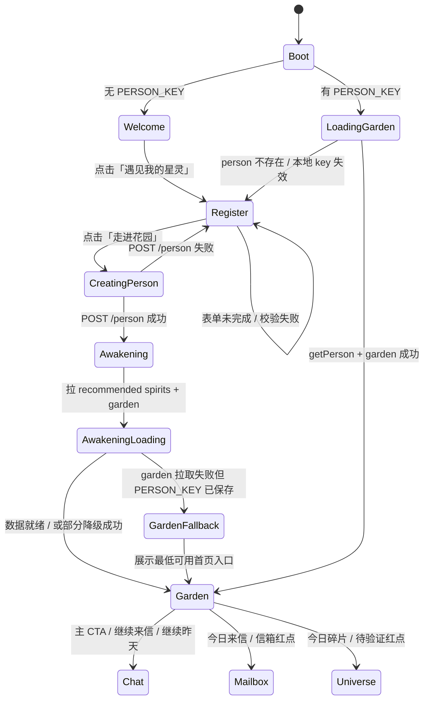
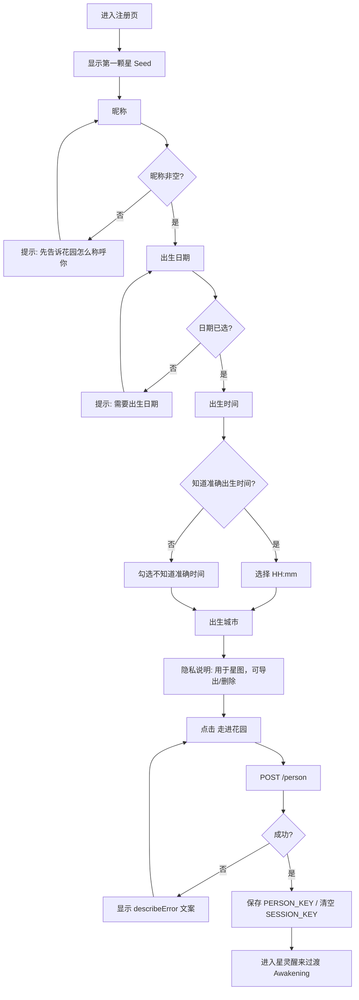
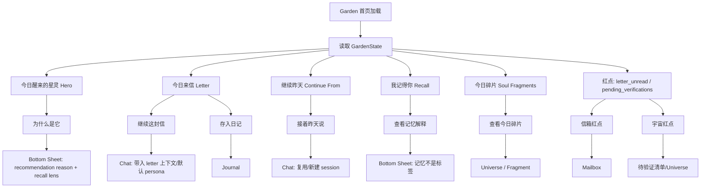
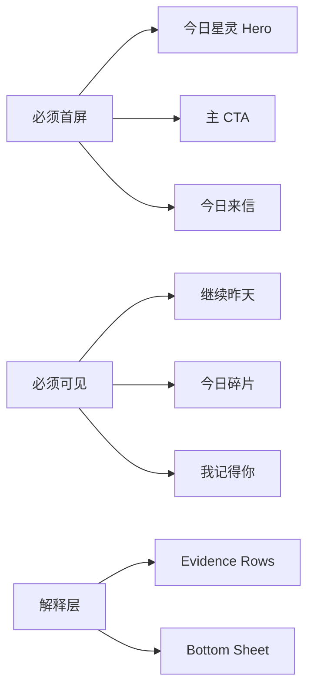
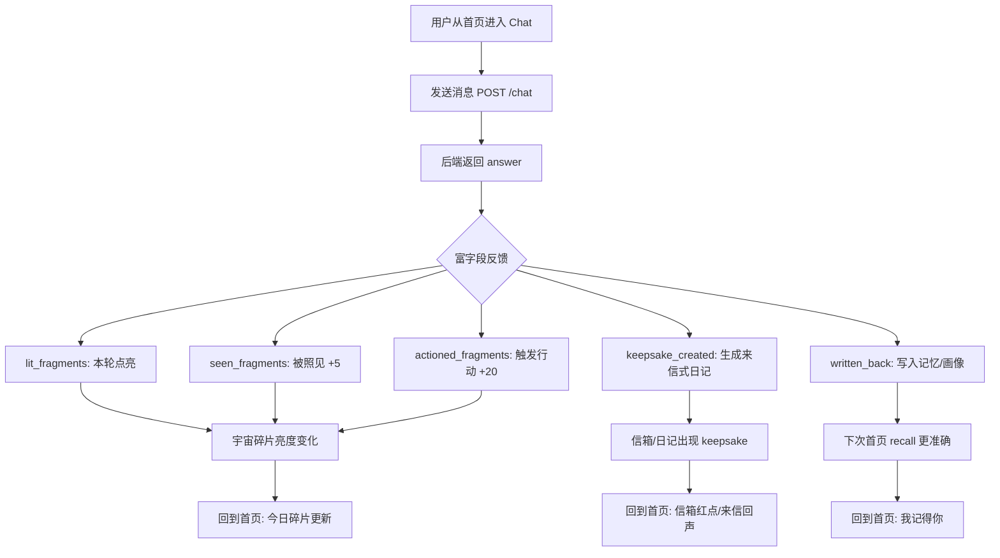
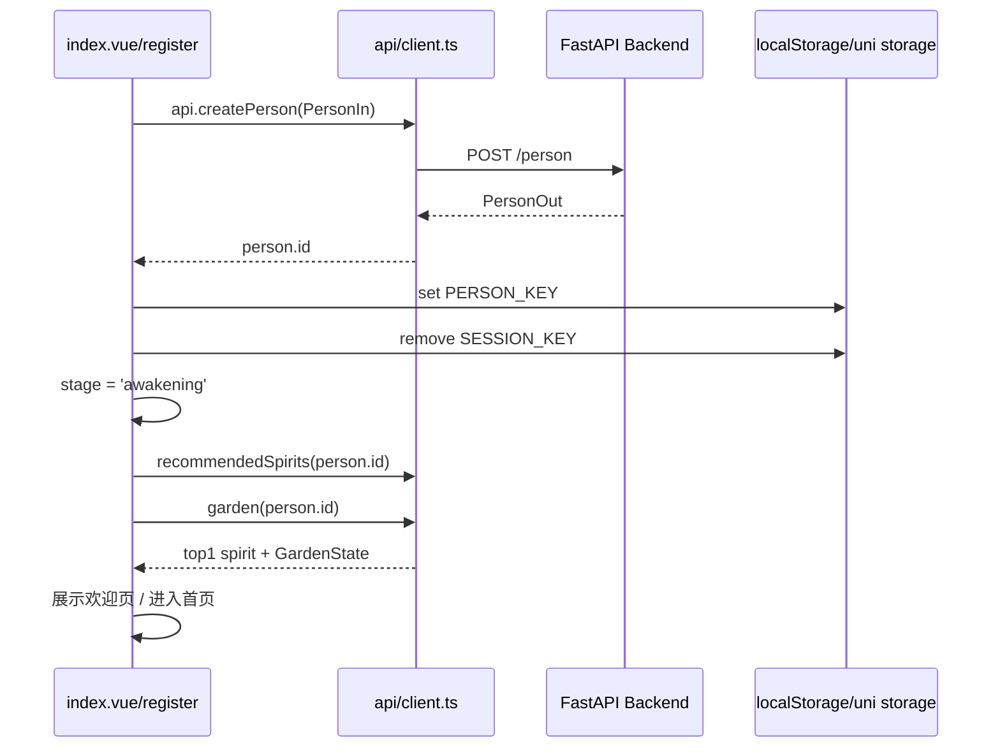
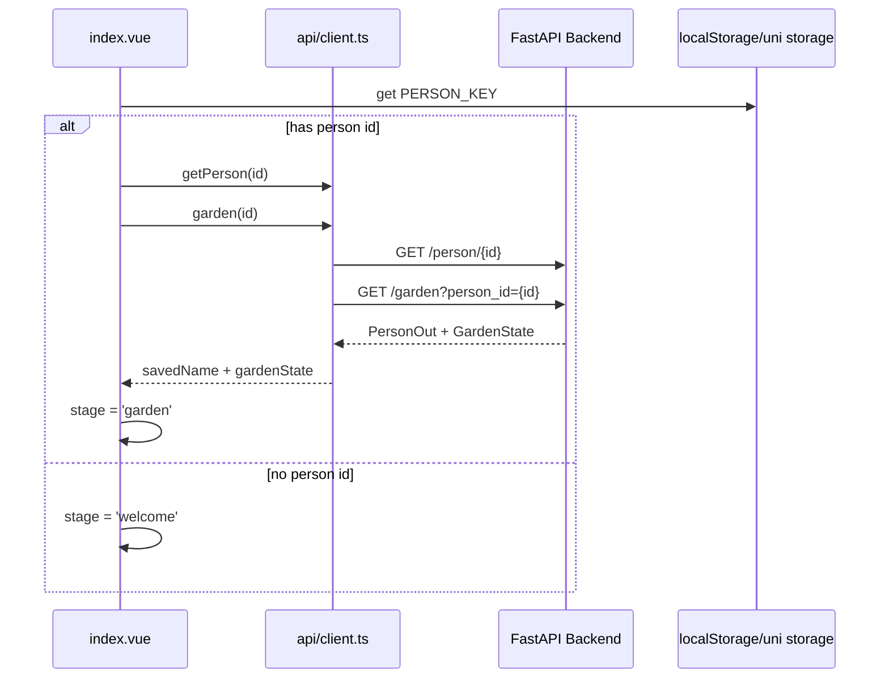
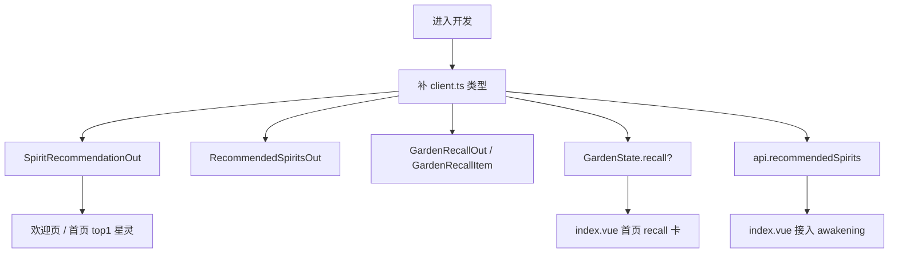
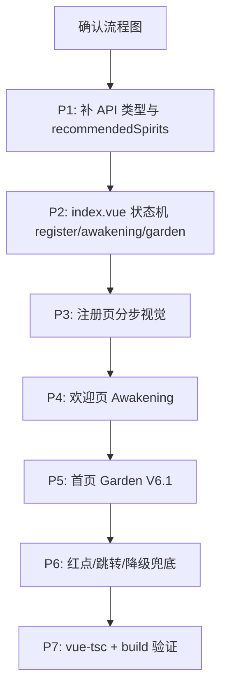

# Garden-Spirit · V6.1 前端流程图

> 日期：2026-08-15  
> 用途：先统一产品/前端/后端状态流，再按流程开发。  
> 范围：首次注册、欢迎页、首页 Garden、聊天回访、信箱/宇宙红点。  
> 当前策略：先在 `frontend/src/pages/index/index.vue` 内实现四态流程，后续再拆独立 onboarding 路由。

---

## 1. 总体用户旅程

```mermaid
flowchart TD
  A[打开 Garden-Spirit] --> B{本地是否有 PERSON_KEY?}
  B -- 否 --> W[品牌欢迎页 Welcome]
  W --> C[注册页 Register]
  B -- 是 --> H[拉取用户与 Garden 首页数据]

  C --> C1[Step 1: 昵称]
  C1 --> C2[Step 2: 出生日期]
  C2 --> C3[Step 3: 出生时间 / 不知道准确时间]
  C3 --> C4[Step 4: 出生城市 + 隐私说明]
  C4 --> D[POST /person 创建档案]

  D --> E{创建成功?}
  E -- 否 --> CERR[注册页展示温柔错误提示]
  CERR --> C4
  E -- 是 --> F[保存 PERSON_KEY 清空 SESSION_KEY]
  F --> G[星灵醒来 Awakening]

  G --> G1[生成中: 星图地形 / 今日星灵 / 第一封星信]
  G1 --> G2[GET recommended-spirits]
  G1 --> G3[GET /garden]
  G2 --> G4[展示今日醒来的星灵 top1]
  G3 --> G5[准备今日来信/继续昨天/碎片/红点]
  G4 --> I[进入首页 Garden]
  G5 --> I

  H --> H1[GET /person/{id}]
  H --> H2[GET /garden?person_id=...]
  H1 --> I
  H2 --> I

  I --> J[首页: 今日星灵 + 私人来信 + 继续昨天 + 我记得你 + 今日碎片]
  J --> K{用户选择}
  K -- 和星灵聊聊 --> L[Chat]
  K -- 继续这封信 --> L
  K -- 存入日记 --> M[Journal]
  K -- 打开信箱 --> N[Mailbox]
  K -- 查看宇宙 --> O[Universe]
  K -- 为什么是它 --> P[Bottom Sheet / Evidence Rows]
```

---

## 2. `index.vue` 四态状态机

短期不拆路由，先把当前 `creating: boolean` 升级为明确状态：

```ts
type HomeStage = 'welcome' | 'register' | 'awakening' | 'garden';
```



### 状态职责

| Stage | 作用 | 主要 UI | 主要数据 |
|---|---|---|---|
| `welcome` | 首次品牌入口 | 星灵旁白式欢迎文案、可互动星灵本体、遇见我的星灵 CTA | 无需后端数据 |
| `register` | 首次建档 | 分步表单、隐私说明、第一颗星 | 本地 form |
| `awakening` | 过渡与仪式感 | 星灵醒来、loading steps、今日 top1 | `recommended-spirits` + `garden` |
| `garden` | 每日回家体验 | 今日星灵、来信、记忆、碎片、红点 | `GardenState` |

---

## 3. 注册页流程图



### 注册页开发映射

| 表单项 | 当前字段 | 规则 |
|---|---|---|
| 昵称 | `form.name` | 必填，trim 后提交 |
| 日期 | `form.date` | 必填 |
| 时间 | `form.time` | `time_unknown=false` 时必填 |
| 不知道时间 | `form.time_unknown` | true 时提交 `12:00:00` + `time_known=false` |
| 城市 | `form.city` | 可选，默认上海 |
| 提交 | `api.createPerson` | 成功后进入 `awakening` |

---

## 4. 星灵醒来 Awakening 流程图

```mermaid
flowchart TD
  A0[进入星灵醒来过渡] --> A1[展示: 你的星图正在长成一座花园]
  A1 --> A2[loading step 1: 计算星图地形]
  A2 --> A3[loading step 2: 寻找今天先醒来的星灵]
  A3 --> A4[loading step 3: 整理第一封私人星信]

  A2 --> P1[GET /person/{id}/recommended-spirits]
  A2 --> G1[GET /garden?person_id=...&persona=top1?]

  P1 --> P2{有推荐星灵?}
  P2 -- 是 --> S1[取 top1 作为今日醒来的星灵]
  P2 -- 否 --> S2[兜底 moon 月亮星灵]

  G1 --> G2{Garden 成功?}
  G2 -- 是 --> D1[缓存 GardenState]
  G2 -- 否 --> D2[兜底首页: 仍可进入聊天]

  S1 --> A5[展示星灵醒来卡]
  S2 --> A5
  D1 --> A5
  D2 --> A5

  A5 --> CTA1[进入花园]
  A5 --> CTA2[先和它说句话]
  CTA1 --> HOME[Garden 首页]
  CTA2 --> CHAT[Chat with persona]
```

### Awakening 视觉节点

| 节点 | 视觉 | 文案 |
|---|---|---|
| 生成中 | 软质星体聚合、星尘轨道 | `你的星图正在长成一座花园` |
| 星灵醒来 | 星灵睁眼、呼吸、top1 chip | `今天，月亮星灵先醒来了` |
| 第一封信 | 轻信纸卡片预览 | `第一封星信正在等你打开` |
| CTA | 双按钮 | `进入花园` / `先和它说句话` |

---

## 5. 首页 Garden 流程图



### 首页模块优先级



---

## 6. Chat 回流闭环

聊天不是独立功能，它会反向改变首页和宇宙。



---

## 7. API 调用顺序

### 首次注册



### 已注册回访



---

## 8. 数据与类型补齐流程



建议新增类型：

```ts
export interface SpiritRecommendationOut {
  planet: string;
  name: string;
  healing_name?: string;
  style?: string;
  score: number;
  reason: string;
  is_default?: boolean;
  is_firdaria_major_lord?: boolean;
  is_firdaria_sub_lord?: boolean;
}

export interface RecommendedSpiritsOut {
  spirits: SpiritRecommendationOut[];
  generated_at?: string;
}

export interface GardenRecallItem {
  kind: string;
  title?: string;
  summary?: string;
  text?: string;
  domain?: string;
}

export interface GardenRecallOut {
  has_memory: boolean;
  items: GardenRecallItem[];
}
```

---

## 9. 开发拆解顺序



### 开发原则

- 先做数据类型和状态流，再做视觉细节。
- 不改 `frontend/src/pages/universe/wheel.vue`。
- 不覆盖 `frontend/prototype_home.html`。
- 生产页先小步改 `index.vue`，不要一次性重构所有页面。
- 首页不要做无限流、Data Table、10 星灵阵列。
- 所有占星结论继续来自后端 Domain，不在前端硬编码判断。

---

## 10. 最小可验收版本

第一轮开发完成后，应满足：

1. 新用户打开后先看到品牌欢迎页，点击「遇见我的星灵」后进入 V6.1 注册页。
2. 填完资料后进入 Awakening 过渡页，看到「星灵醒来」仪式。
3. 星灵醒来过渡页可进入首页或聊天。
4. 老用户打开后直接进入 Garden 首页。
5. 首页展示：今日星灵、今日来信、继续昨天、今日碎片、红点入口。
6. 数据拉取失败时不白屏，至少保留聊天入口。
7. `vue-tsc` 与 H5 build 通过。
